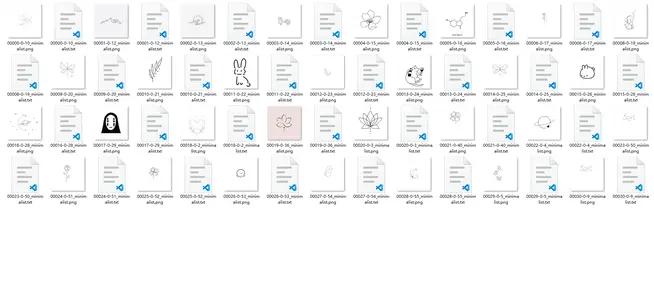

# xiaowen-sd-model

## 项目介绍

本项目为《小纹AI》项目的一部分。主要功能是提供 Stable diffusion 相关模型，以及训练集数据。

- [xiaowen-wechat-miniprogram](https://github.com/VeejaLiu/xiaowen-wechat-miniprogram)：微信小程序前端项目
- [xiaowen-backend](https://github.com/VeejaLiu/xiaowen-backend)：后端项目
- [xiaowen-BMC](https://github.com/VeejaLiu/xiaowen-BMC)：后台管理前端项目
- （当前）[xiaowen-sd-model](https://github.com/VeejaLiu/xiaowen-sd-model)
  ：Stable diffusion 相关资源（模型、数据集等）

## 项目结构

- `LoRA-dataset/`：LoRA训练需要的数据集

 

 
